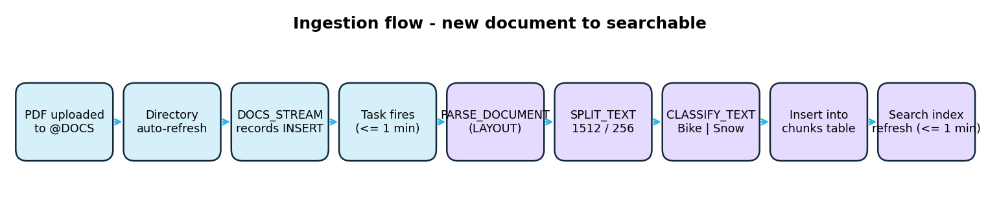
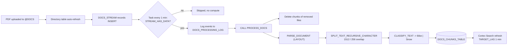
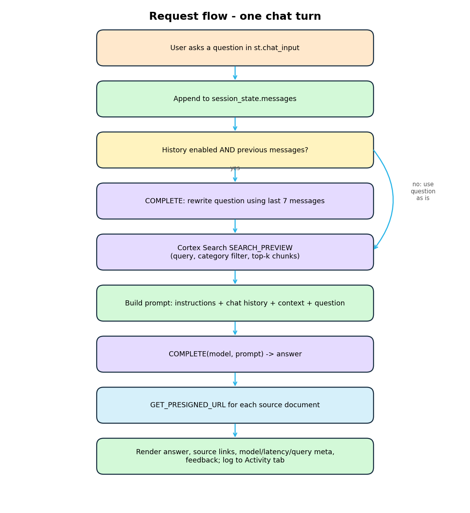
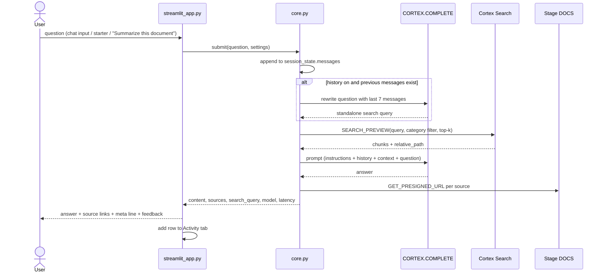
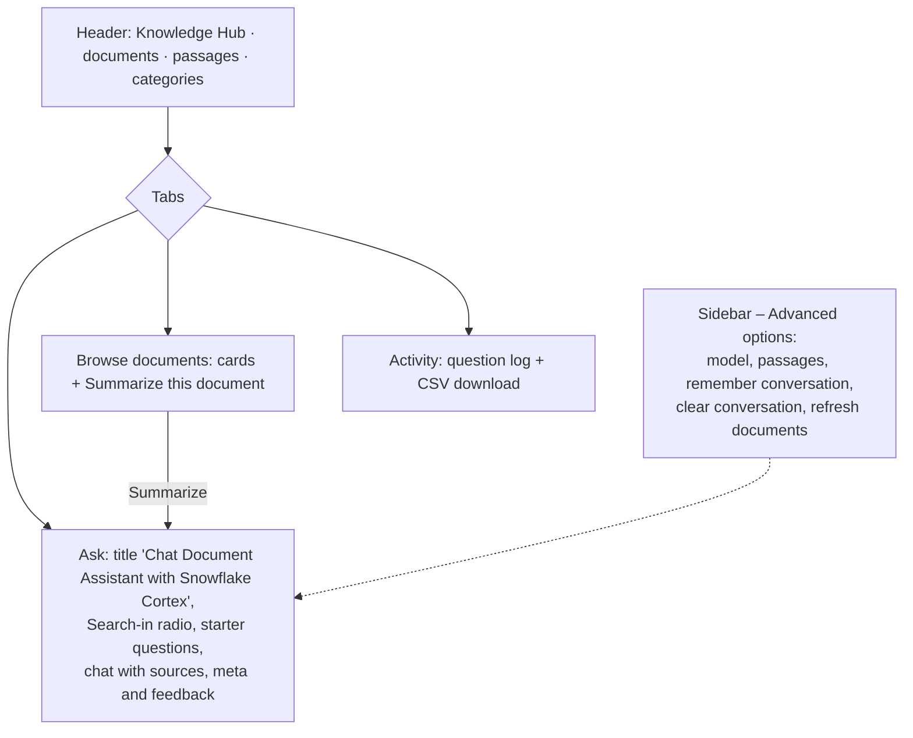

# 3. Flow Diagrams

## 3.1 Ingestion flow (new document → searchable)

```mermaid
flowchart LR
    A[PDF uploaded to @DOCS] --> B[Directory table auto-refresh]
    B --> C[DOCS_STREAM records INSERT]
    C --> D{"Task every 1 min:<br/>STREAM_HAS_DATA?"}
    D -- no --> X[Skipped, no compute]
    D -- yes --> E[Log events to DOCS_PROCESSING_LOG]
    E --> F[CALL PROCESS_DOCS]
    F --> G[Delete chunks of removed files]
    F --> H["PARSE_DOCUMENT (LAYOUT)"]
    H --> I["SPLIT_TEXT_RECURSIVE_CHARACTER<br/>1512 / 256 overlap"]
    I --> J["CLASSIFY_TEXT -> Bike | Snow"]
    J --> K[(DOCS_CHUNKS_TABLE)]
    K --> L["Cortex Search refresh<br/>TARGET_LAG 1 min"]
```

## 3.2 Request flow (one chat turn)

```mermaid
sequenceDiagram
    actor U as User
    participant UI as streamlit_app.py
    participant C as core.py
    participant LLM as CORTEX.COMPLETE
    participant CS as Cortex Search
    participant S as Stage DOCS
    U->>UI: question (chat input / starter / "Summarize this document")
    UI->>C: submit(question, settings)
    C->>C: append to session_state.messages
    alt history on and previous messages exist
        C->>LLM: rewrite question with last 7 messages
        LLM-->>C: standalone search query
    end
    C->>CS: SEARCH_PREVIEW(query, category filter, top-k)
    CS-->>C: chunks + relative_path
    C->>LLM: prompt (instructions + history + context + question)
    LLM-->>C: answer
    C->>S: GET_PRESIGNED_URL per source
    C-->>UI: content, sources, search_query, model, latency
    UI-->>U: answer + source links + meta line + feedback
    UI->>UI: add row to Activity tab
```

## 3.3 UI navigation

```mermaid
flowchart TB
    SB["Sidebar – Advanced options:<br/>model, passages, remember conversation,<br/>clear conversation, refresh documents"]
    H["Header: Knowledge Hub · documents · passages · categories"] --> T{Tabs}
    T --> A["Ask: title 'Chat Document Assistant with Snowflake Cortex',<br/>Search-in radio, starter questions,<br/>chat with sources, meta and feedback"]
    T --> B["Browse documents: cards + Summarize this document"]
    T --> L["Activity: question log + CSV download"]
    B -- "Summarize" --> A
    SB -.-> A
```
